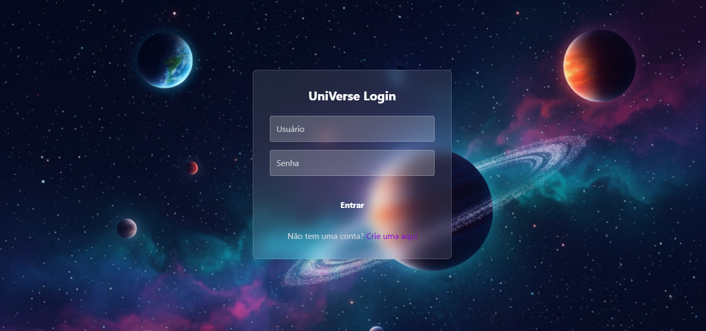
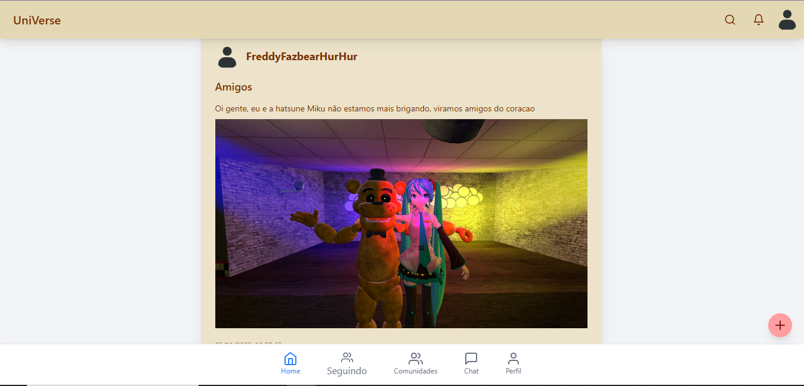
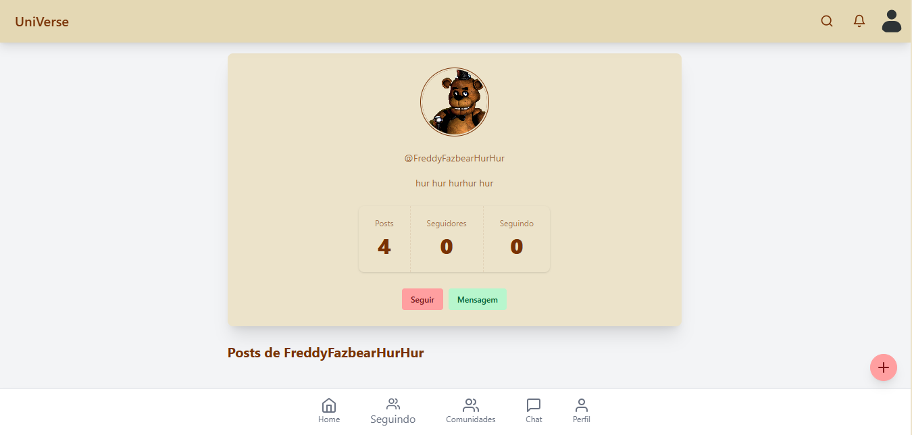
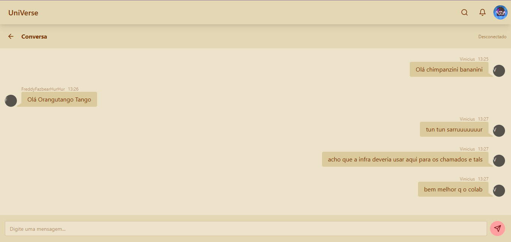
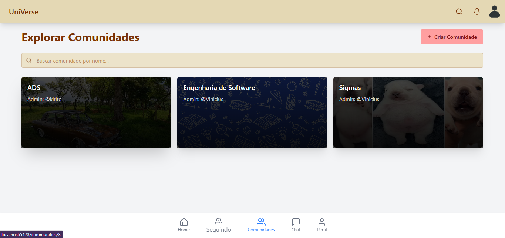
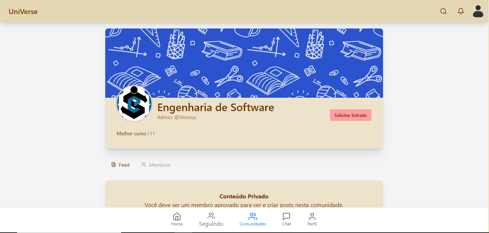
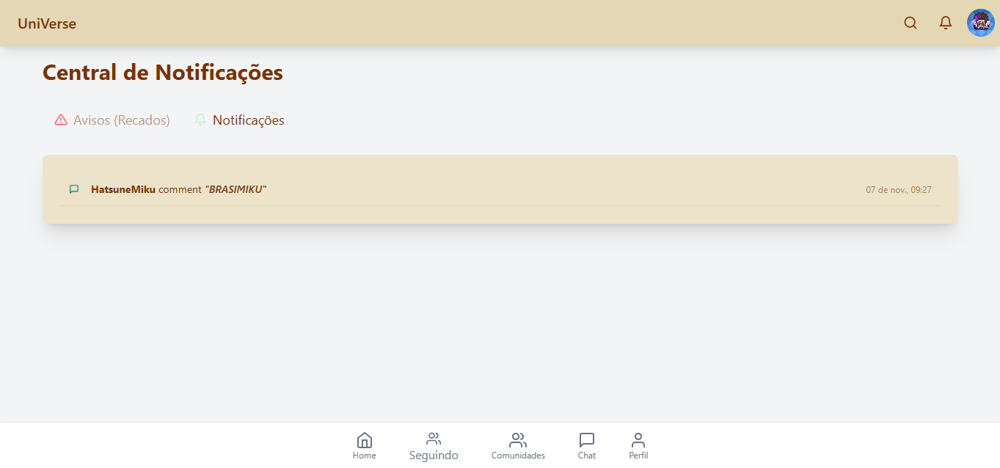
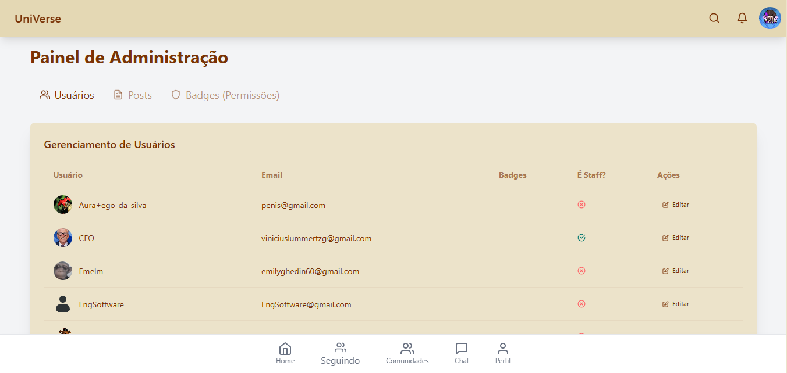

# UniVerse 🚀
> **The Social Network for University Life.**


**UniVerse** is a specialized social platform designed to connect students, professors, and university communities. Unlike generic social media, UniVerse focuses on the academic ecosystem, facilitating communication through course-specific communities, real-time messaging, and a student-centric feed.

---

## ✨ Key Features

- **🌐 Global & Community Feeds**: Share updates with the entire campus or post privately within your course community.
- **💬 Real-Time Chat**: Direct messaging powered by WebSockets (Django Channels) for instant collaboration.
- **👥 Communities (Groups)**: Join private or public communities based on your major, interests, or athletics.
- **🎨 Modern UI/UX**: Built with React 19, TailwindCSS, and DaisyUI for a sleek, responsive, and themeable experience.
- **🏆 Gamification**: Earn badges like "Professor" or "Top Contributor" (Admin managed).
- **🔒 Secure Authentication**: JWT-based stateless authentication with automatic token refreshing.

---

## 🛠️ Tech Stack

### Frontend (`/client`)
- **Framework**: React 19
- **Build Tool**: Vite
- **Styling**: TailwindCSS v4 + DaisyUI
- **State Management**: React Context API
- **Routing**: React Router v7
- **HTTP Client**: Axios (with Interceptors)

### Backend (`/core` & `/config`)
- **Framework**: Django & Django REST Framework (DRF)
- **Real-Time**: Django Channels (WebSockets)
- **Database**: SQLite (Dev) / PostgreSQL (Ready)
- **Auth**: Simple JWT

---

## 🚀 Getting Started

Follow these steps to set up the project locally.

### Prerequisites
- Node.js (v18+)
- Python (v3.10+)

### 1. Clone the Repository
```bash
git clone https://github.com/yourusername/UniVerse.git
cd UniVerse
```

### 2. Backend Setup
Create a virtual environment and install dependencies.

```bash
# Windows
python -m venv venv
.\venv\Scripts\activate

# Linux/Mac
python3 -m venv venv
source venv/bin/activate

# Install requirements
pip install -r requirements.txt

# Run Migrations
python manage.py migrate

# Start Server
python manage.py runserver 0.0.0.0:8000
```
*The API will run at `http://127.0.0.1:8000/`*

### 3. Frontend Setup
Open a new terminal for the client.

```bash
cd client

# Install dependencies
npm install

# Start Development Server
npm run dev -- --host
```
*The app will run at `http://localhost:5173/`*

---

## 📸 Screenshots

| Login Page | Feed |
|:---:|:---:|
|  |  |
















---

## 🤝 Contributing

Contributions are welcome! Please read our [CONTRIBUTING.md](CONTRIBUTING.md) for details on our code of conduct, and the process for submitting pull requests.

## 📄 License

This project is licensed under the MIT License - see the [LICENSE](LICENSE) file for details.
